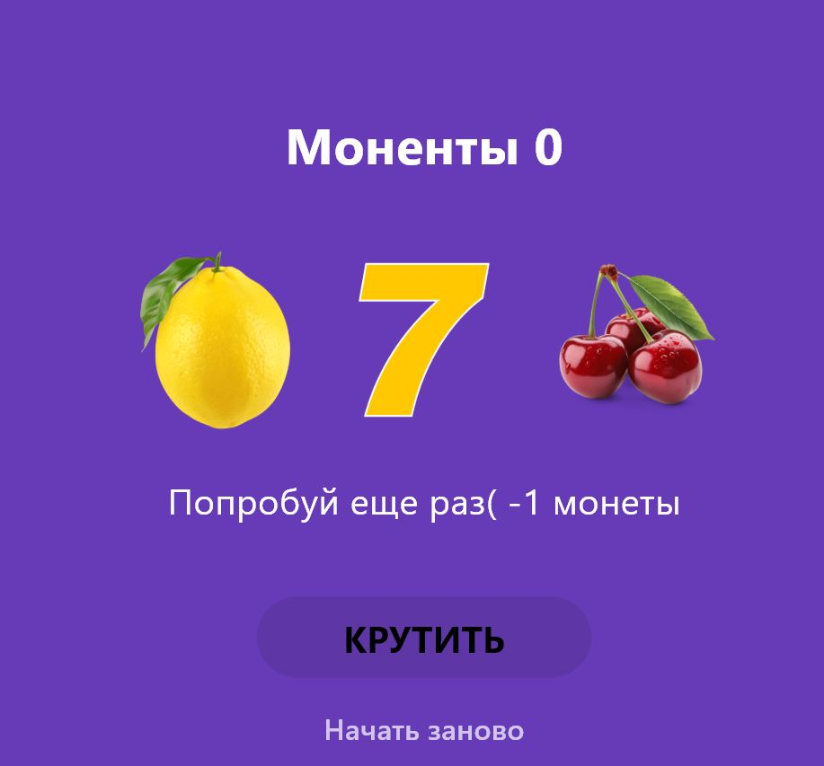

# Слот-машина

🎰 Игровой автомат на Flutter с анимацией барабанов, звуковыми эффектами и поддержкой Web и Android.

## Как играть

- Нажмите **КРУТИТЬ**, чтобы запустить барабаны
- Три одинаковых символа — победа (+3 монеты)
- Три семёрки — джекпот (+10 монет)
- Разные символы — проигрыш (-1 монета)
- Кнопка **Начать заново** сбрасывает счёт до 10 монет
- 🔊 Кнопка звука включает/выключает фоновую музыку и эффекты

## Скриншоты

 
## Запуск проекта

### Требования
- Flutter 3.x
- Dart 3.x
- Браузер Chrome (для Web) или Android-устройство/эмулятор

### Инструкция

```bash
# Клонировать репозиторий
git clone https://github.com/Paltosik92/slot_machine

# Перейти в папку проекта
cd slot_machine

# Установить зависимости
flutter pub get

# Запустить в Chrome
flutter run -d chrome
```

# Установка на Android

flutter build apk --release

# Что изучено

StatefulWidget и управление состоянием через setState()

Работа с локальными изображениями через Image.asset()

Генерация случайных чисел через dart:math

Анимация через async/await и AnimatedOpacity

Создание иконки в Krita и подключение через flutter_launcher_icons

Воспроизведение звука на Web и Android с помощью audioplayers

Сборка под Web (flutter build web) и Android (flutter build apk)

Dragonyafa
исп 233